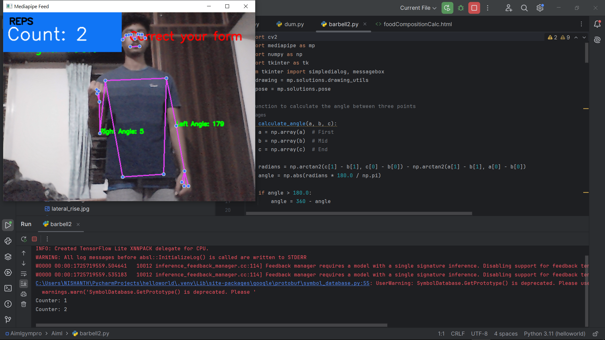
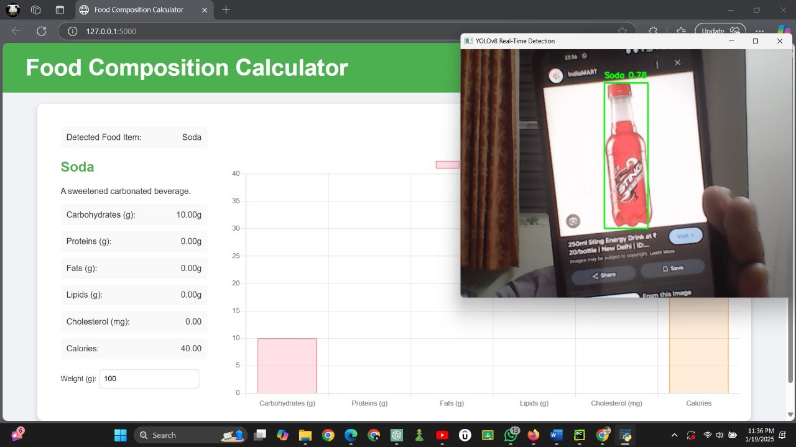

# StrideSync - AI Enhanced Workout Tracking and Form Validation  

## Overview  
StrideSync is an AI-powered fitness tracking system integrating **computer vision**, **machine learning**, and **natural language processing (NLP)** to provide:  
- **Real-time exercise monitoring & form validation**  
- **Food composition analysis using YOLOv8**  
- **AI Chatbot for fitness & nutrition guidance**  

---

## Features  

### 💪 Exercise Tracking & Form Validation  
- Uses **MediaPipe Pose** and **OpenCV** to analyze workout posture.  
- **Repetition counting** based on joint angle calculations.  
- **Real-time feedback** on exercise form (e.g., “Correct your form!”).  

  

---

### 🍎 Food Composition Analysis  
- **YOLOv8-based object detection** for food recognition.  
- **Nutritional breakdown** (calories, protein, fats, carbs) based on weight input.  
- **Interactive Web UI** displaying food composition using Chart.js.  

  

---

### 🤖 AI Chatbot for Fitness Guidance  
- **NLP-based chatbot** trained on fitness and nutrition-related queries.  
- Provides responses to:  
  - **Exercise suggestions** (e.g., “What exercises help with weight loss?”)  
  - **Diet plans** (e.g., “What should I eat to lose weight?”)  
  - **Caloric values** (e.g., “How many calories are in a banana?”)  
- Built using **TensorFlow, LSTM, and scikit-learn** for intent classification.  


---

## Dataset & Training  

### 📂 Dataset  
The dataset used for training can be accessed here:  
[📂 StrideSync Dataset](https://drive.google.com/drive/folders/1Q-MHkC48NIfAhP-ZGC5UcTPAwMaMw8va?usp=drive_link)  

### 📌 Chatbot Training  
The **NLP-based chatbot** was trained using Google Colab. You can check the training notebook here:  
[🤖 Chatbot Training Notebook](https://colab.research.google.com/drive/1zSyH7MFbrLRCkyy82OlJt4DWXnedfZ_0?usp=drive_link)  

### 📌 YOLOv8 Model Training  
The **food detection YOLOv8 model** was trained in Google Colab, and the **best.pt** file was used in the final project.  
[📦 YOLOv8 Training Notebook](https://colab.research.google.com/drive/194_Tg3Zx0Ou2IAS8jPCaeHCvZYPMqMbu?usp=drive_link)  

---

## Technologies Used  

| Category          | Tools & Libraries  |  
|------------------|------------------|  
| **Computer Vision** | OpenCV, MediaPipe, YOLOv8 |  
| **Machine Learning** | TensorFlow, PyTorch, scikit-learn |  
| **Backend** | Flask |  
| **Frontend** | HTML, CSS, JavaScript |  
| **NLP & Chatbot** | LSTM, Tokenizer, LabelEncoder |  
| **Data Visualization** | Chart.js |  

---

## Installation  

### 🔹 Clone the Repository  
```sh
git clone https://github.com/your-username/StrideSync.git
cd StrideSync

---

